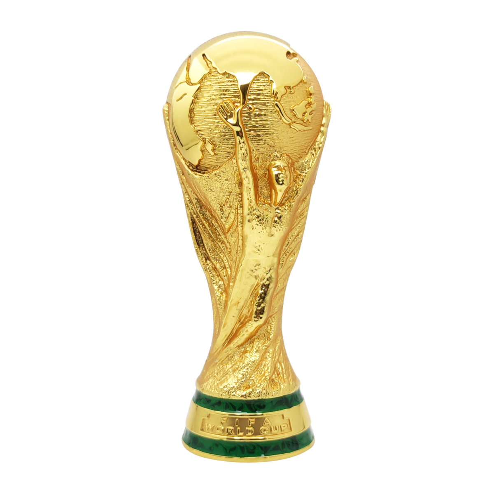

  
  
  
  
  
  
  
  

  

# FIFA World Cup Bracket

Interactive World Cup posters with the group stage, knockout bracket, and standings. The app pulls match data from multiple sources and uses your browser language by default.

**Live:** [jeffreymooiweer.github.io/FIFAWorldCup](https://jeffreymooiweer.github.io/FIFAWorldCup/)

The site is hosted on [GitHub Pages](https://pages.github.com/) and updates automatically on every push to `main`.

## How it works

Use the dock at the bottom to pick an **edition** (year) and switch between **poster** and **list**. Poster view shows the full bracket; on mobile you can pinch to zoom. List view lets you scroll through every match.

Tap a group to open **standings**. Matches involving the Netherlands are highlighted in orange. Language follows your device; add `?lang=nl` (or another language code) to override it.
